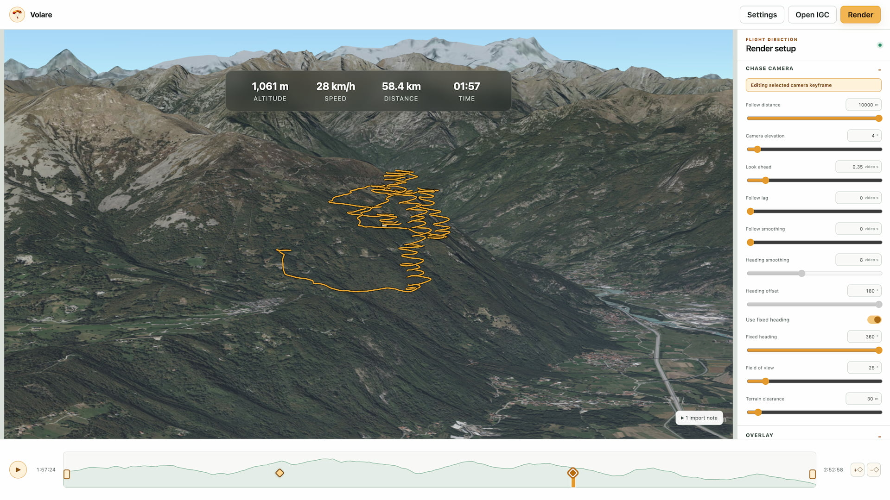

# 🪂 Volare

Turn paragliding IGC tracks into cinematic 3D flight videos.



[Open Volare](https://volare.davide.im)

Volare is a browser-based flight visualizer and video renderer. Load an IGC file, frame the flight with an animated chase camera, customize the route and telemetry, and export the result as an H.264 MP4 over Cesium's 3D terrain.

## Features

- Local IGC import with flight metadata and altitude-profile timeline
- Interactive 3D preview using Cesium terrain and satellite imagery
- Customizable chase camera with smoothly interpolated keyframes
- Draggable trim controls and camera keyframes
- Progressive trail, optional ghost route, and configurable track styling
- Altitude, speed, distance, and elapsed-time overlays
- Landscape and vertical output at 1080p, 1440p, or 4K
- H.264 MP4 export at 24, 30, or 60 fps
- Metric and imperial units
- Local-first processing: flight files are not uploaded to a server

## Getting Started

### Requirements

- Node.js 22 or newer
- A current desktop version of Chrome or Edge for MP4 export
- A free [Cesium ion](https://ion.cesium.com/) access token with the `assets:read` scope

### Run Locally

```bash
npm install
cp .env.example .env.local
npm run dev
```

Add your Cesium ion token to `.env.local`:

```env
VITE_CESIUM_ION_TOKEN=your_token_here
```

Alternatively, leave the environment variable empty and enter the token from the application's Settings dialog. Tokens entered in the UI are stored only in the browser's local storage.

## Usage

1. Open or drop an `.igc` flight file.
2. Set the start and end points on the timeline.
3. Configure the chase camera, track style, and telemetry overlay.
4. Add camera keyframes and drag them along the timeline to compose the shot.
5. Select **Render**, choose a destination, and wait for the MP4 export to finish.

Rendering is frame-accurate rather than real-time. Volare waits for Cesium terrain and imagery to settle before encoding each frame, so high-resolution or high-frame-rate exports can take considerably longer than the finished video.

## Privacy

IGC files are parsed and rendered locally in your browser. Volare does not upload flight tracks to an application server. The browser connects to Cesium ion to retrieve terrain and imagery tiles required for the 3D scene.

## Development

```bash
npm run typecheck
npm run lint
npm test
npm run build
npm run test:e2e
```

The end-to-end suite uses desktop Chrome and includes a real WebCodecs/Mediabunny H.264 encode and MP4 metadata check.

## Technology

- React and TypeScript
- Vite
- CesiumJS
- Mediabunny and WebCodecs
- Vitest and Playwright

## Cesium Attribution

Volare uses Cesium World Terrain and ion-hosted imagery. Keep the displayed attribution intact and follow the relevant data-provider terms when publishing exported videos.
